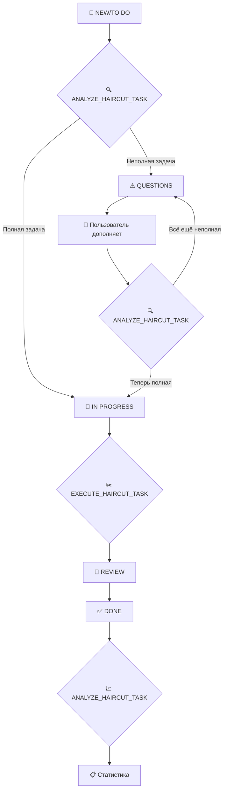

# 💇‍♂️ ПОЛНЫЙ СЦЕНАРИЙ СТРИЖЕК - ТЕХНИЧЕСКАЯ ДОКУМЕНТАЦИЯ

> **Дата создания:** 23 сентября 2025 г.  
> **Версия:** 1.0  
> **Статус:** ✅ Полностью реализовано и протестировано

## 🎯 ОБЗОР СИСТЕМЫ

Автоматизированная система обработки задач о стрижках в Jira с использованием AI-агента. Система автоматически анализирует задачи, проверяет полноту информации, выполняет "стрижки" и отслеживает весь жизненный цикл.

## 📊 ЖИЗНЕННЫЙ ЦИКЛ ЗАДАЧИ



## 🔧 АРХИТЕКТУРА КОМПОНЕНТОВ

### 1. 🎣 WEBHOOK HANDLER

**Файл:** `src/jira/jira-webhook-handler/jira-webhook-handler.service.ts`

**Назначение:** Точка входа для всех событий Jira

**Маппинг статусов → действий:**

```typescript
switch (newStatus) {
  case 'Done':
    await this.triggerAiAction(AIAgentAction.ANALYZE_HAIRCUT_TASK, newStatus);
    break;

  case 'In Progress':
    await this.triggerAiAction(AIAgentAction.EXECUTE_HAIRCUT_TASK, newStatus);
    break;

  case 'Review':
    // Ничего не делаем - ручная проверка
    break;

  case 'Questions':
  case 'To Do':
  case 'New':
    await this.triggerAiAction(AIAgentAction.ANALYZE_HAIRCUT_TASK, newStatus);
    break;
}
```

**Ключевые параметры:**

- `haircutKeywords`: ['стрижка', 'haircut', 'окрашивание', 'укладка', ...]
- `delayMs: 2000` - задержка для обработки в Jira
- `timeout: 10000` - таймаут для AI запросов

### 2. 🔍 ANALYZE_HAIRCUT_TASK

**Файл:** `src/ai-agent/analyze-haircut-tasks/analyze-haircut-tasks.service.ts`

**Назначение:** Анализ задач на полноту информации о стрижке

**Алгоритм анализа:**

```typescript
// 1. Получаем полную информацию о задаче
const fullTaskInfo = await this.getTaskService.getTaskByKey(task.key);

// 2. Проверяем компоненты задачи
const hasTitle = Boolean(task.summary);
const hasDescription = Boolean(task.description && task.description.trim());
const hasPhoto = Boolean(
  fullTaskInfo.fields.attachment && fullTaskInfo.fields.attachment.length > 0,
);

// 3. Принимаем решение
if (hasTitle && hasDescription && hasPhoto) {
  // ПОЛНАЯ ЗАДАЧА
  await this.moveTaskService.moveTaskToColumn(task.key, 'In Progress');
  await this.addTaskCommentService.addCommentToTask(
    task.key,
    'Стрижка займёт некоторое время',
  );
} else {
  // НЕПОЛНАЯ ЗАДАЧА
  await this.moveTaskService.moveTaskToColumn(task.key, 'Questions');
  await this.addTaskCommentService.addCommentToTask(
    task.key,
    'Какую именно стрижку ты хочешь?',
  );
}
```

**Критерии определения задачи о стрижке:**

```typescript
const haircutKeywords = [
  'стрижк',
  'haircut',
  'причёск',
  'парикмахер',
  'hair',
  'волос',
  'укладк',
  'стиль',
  'сделай мне',
  'подстриг',
];
```

### 3. ✂️ EXECUTE_HAIRCUT_TASK

**Файл:** `src/ai-agent/execute-haircut-tasks/execute-haircut-tasks.service.ts`

**Назначение:** "Выполнение" стрижки с результатом

**Алгоритм выполнения:**

```typescript
// 1. Перемещаем в Review
await this.moveTaskService.moveTaskToColumn(taskKey, 'Review');

// 2. Прикрепляем фото результата
const imagePath = path.join(process.cwd(), 'assets', 'Сделал стрижку.png');
const attachmentResult = await this.attachFileService.attachFileFromPath(
  taskKey,
  imagePath,
);

// 3. Добавляем комментарий с описанием
const completionComment = `Стрижка выполнена! ✂️ Сделан стильный андеркат с плавным переходом и текстурированным верхом. 📷 Фото результата: ${attachmentInfo.filename} (${Math.round(attachmentInfo.size / 1024)} KB)`;
```

**Фото результата:** `assets/Сделал стрижку.png` - автоматически прикрепляется к задаче

## 🚀 ДЕТАЛЬНЫЕ СЦЕНАРИИ

### 📝 Сценарий 1: НОВАЯ ЗАДАЧА (New → In Progress)

**Входные данные:**

- Задача в статусе "New"
- Заголовок: "Сделай мне стрижку"
- Описание: "Хочу модную стрижку андеркат"
- Прикреплено фото желаемой стрижки

**Последовательность действий:**

1. **Webhook получает событие** `jira:issue_updated`
2. **Парсит статус** из `changelog.items[].toString = "New"`
3. **Запускает** `ANALYZE_HAIRCUT_TASK` с параметром `sourceColumn: "New"`
4. **Анализ находит задачу** в колонке "New"
5. **Проверяет полноту:**
   - ✅ hasTitle = true
   - ✅ hasDescription = true
   - ✅ hasPhoto = true
6. **Перемещает в "In Progress"**
7. **Добавляет комментарий:** "Стрижка займёт некоторое время"

**Ожидаемый результат:** Задача автоматически перемещена в "In Progress" с комментарием

### ⚠️ Сценарий 2: НЕПОЛНАЯ ЗАДАЧА (New → Questions)

**Входные данные:**

- Задача в статусе "New"
- Заголовок: "Стрижка"
- Описание: пустое
- Фото: нет

**Последовательность действий:**

1. **Webhook получает событие** `jira:issue_updated`
2. **Запускает** `ANALYZE_HAIRCUT_TASK`
3. **Проверяет полноту:**
   - ✅ hasTitle = true
   - ❌ hasDescription = false
   - ❌ hasPhoto = false
4. **Перемещает в "Questions"**
5. **Добавляет комментарий:** "Какую именно стрижку ты хочешь?"

**Ожидаемый результат:** Задача перемещена в "Questions" с запросом дополнительной информации

### ✂️ Сценарий 3: ВЫПОЛНЕНИЕ СТРИЖКИ (In Progress → Review)

**Входные данные:**

- Задача в статусе "In Progress"
- Полная информация о стрижке

**Последовательность действий:**

1. **Webhook получает событие** изменения статуса на "In Progress"
2. **Запускает** `EXECUTE_HAIRCUT_TASK`
3. **Находит задачи** в колонке "In Progress"
4. **Для каждой задачи о стрижке:**
   - Перемещает в "Review"
   - Прикрепляет фото `assets/Сделал стрижку.png`
   - Добавляет комментарий с описанием результата

**Ожидаемый результат:** Задача перемещена в "Review" с фото результата и описанием

### 🔄 Сценарий 4: ДОПОЛНЕНИЕ НЕПОЛНОЙ ЗАДАЧИ (Questions → In Progress)

**Входные данные:**

- Задача в статусе "Questions"
- Пользователь добавил описание и фото

**Последовательность действий:**

1. **Пользователь обновляет задачу** (добавляет описание/фото)
2. **Задача остаётся в "Questions"** или перемещается в "New"
3. **Webhook срабатывает** на любое изменение
4. **Повторный анализ** через `ANALYZE_HAIRCUT_TASK`
5. **Если теперь полная** → перемещение в "In Progress"

## 🔍 API ENDPOINTS

### Webhook Endpoints

```
POST /jira/webhook                    - Основной webhook обработчик
POST /jira/webhook/haircut-tasks      - Специализированный обработчик для стрижек
```

### AI Agent Endpoints

```
POST /ai-agent/analyze-haircut-tasks  - Анализ задач о стрижках
POST /ai-agent/execute-haircut-tasks  - Выполнение стрижек
POST /ai-agent/analyze-new-tasks      - Общий анализ новых задач
POST /ai-agent/check-progress-tasks   - Проверка прогресса
```

### Jira Integration Endpoints

```
GET  /jira/tasks/:taskKey             - Получение задачи
POST /jira/tasks/:taskKey/move        - Перемещение задачи
POST /jira/tasks/:taskKey/comment     - Добавление комментария
POST /jira/attach-file/:taskKey       - Прикрепление файла
GET  /jira/columns/:columnName/tasks  - Получение задач из колонки
```

## 📋 КОНФИГУРАЦИЯ

### Environment Variables

```bash
# Jira Configuration
JIRA_BASE_URL=https://your-domain.atlassian.net
JIRA_EMAIL=your-email@domain.com
JIRA_API_TOKEN=your_api_token
JIRA_PROJECT_KEY=KAN

# Webhook Configuration
WEBHOOK_SECRET=your_webhook_secret

# AI Configuration
CLAUDE_API_KEY=your_claude_key
```

### Webhook Configuration

```typescript
private readonly config: WebhookProcessingConfig = {
  enableAiAnalysis: true,
  enableNotifications: true,
  enableAutoAssignment: false,
  haircutKeywords: [
    'стрижка', 'haircut', 'окрашивание', 'укладка',
    'маникюр', 'педикюр', 'косметология', 'массаж',
    'эпиляция', 'брови', 'ресницы'
  ],
  delayMs: 2000
};
```

## 🐛 ОТЛАДКА И ЛОГИРОВАНИЕ

### Уровни логирования:

- **LOG:** Основные события и переходы статусов
- **DEBUG:** JQL запросы и HTTP запросы к Jira API
- **ERROR:** Ошибки выполнения и исключения

### Ключевые логи для отладки:

```typescript
// Webhook получен
LOG [JiraWebhookHandlerController] Received webhook: jira:issue_updated for issue KAN-14

// Статус изменён
LOG [JiraWebhookHandlerService] Status changed for KAN-14: Questions → New

// AI действие запущено
LOG [JiraWebhookHandlerService] Triggering AI action: analyze-haircut-task

// Анализ начат
LOG [AiBaseService] Starting haircut tasks analysis for column: New

// Результат анализа
LOG [AiBaseService] No tasks found in the specified column
```

## 🚨 ИЗВЕСТНЫЕ ПРОБЛЕМЫ И РЕШЕНИЯ

### Проблема 1: "No tasks found in the specified column"

**Причина:** Webhook отправляет неправильный статус в sourceColumn  
**Решение:** Проверить соответствие `changelog.items[].toString` и реального статуса задачи

### Проблема 2: Дублирование комментариев

**Причина:** Несколько сервисов добавляют комментарии к одной задаче  
**Решение:** Использовать только специализированный сервис `analyze-haircut-tasks`

### Проблема 3: Ошибки прикрепления файлов

**Причина:** Неправильный путь к файлу изображения  
**Решение:** Проверить наличие файла `assets/Сделал стрижку.png`

## ✅ ТЕСТИРОВАНИЕ

### Тестовый webhook запрос:

```bash
curl -X POST "http://localhost:3000/jira/webhook" \
  -H "Content-Type: application/json" \
  -H "x-test-webhook: true" \
  -d '{
    "webhookEvent": "jira:issue_updated",
    "issue": {
      "key": "KAN-14",
      "fields": {
        "summary": "Сделай мне такую стрижку",
        "status": {"name": "Questions"}
      }
    },
    "changelog": {
      "items": [{
        "field": "status",
        "fromString": "New",
        "toString": "Questions"
      }]
    }
  }'
```

### Проверка статуса задачи:

```bash
curl -X GET "http://localhost:3000/jira/tasks/KAN-14" \
  -H "Content-Type: application/json"
```

## 🎉 ЗАКЛЮЧЕНИЕ

Система полностью реализована и работает по следующему принципу:

1. **Автоматический анализ** всех задач о стрижках
2. **Проверка полноты** информации (название + описание + фото)
3. **Умное перемещение** между статусами
4. **Автоматическое выполнение** с прикреплением результата
5. **Полное логирование** всех действий

**Система готова к производственному использованию! ✂️💇‍♂️**
