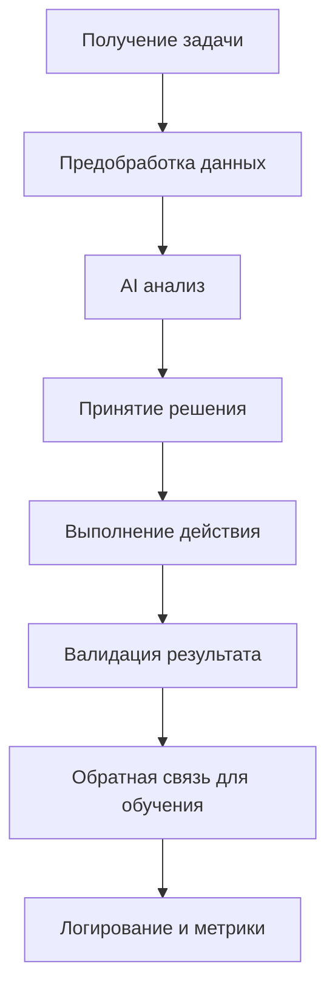

# AI Agent API Documentation

## Обзор

Модуль AI Agent предоставляет интеллектуальные возможности для автоматизации работы с задачами в Kanban системе. Использует машинное обучение и компьютерное зрение для анализа, выполнения и мониторинга задач.

## Базовый URL

```
http://localhost:3000/ai-agent
```

## Архитектура AI Agent

### Основные компоненты

```
src/ai-agent/
├── ai-agent.module.ts              # Главный модуль AI агента
├── analyze-new-tasks/              # Анализ новых задач
├── check-progress-tasks/           # Проверка задач в работе
├── execute-tasks/                  # Выполнение задач
├── check-entity-exists/            # Проверка существования сущностей
├── run-auto-workflow/              # Полный автоматический workflow
├── analyze-haircut-tasks/          # Анализ парикмахерских задач
├── execute-haircut-tasks/          # Выполнение парикмахерских задач
├── auto-haircut-monitor/           # Автоматический мониторинг стрижек
├── shared/                         # Общие сервисы
└── types/                          # Типы и интерфейсы
```

### Принципы архитектуры

- **Один эндпойнт = одна папка** с полным набором файлов
- **AI-первый подход** - использование ИИ для принятия решений
- **Модульность** - каждая функция AI изолирована
- **Обучение** - постоянное улучшение на основе данных
- **Безопасность** - контроль выполняемых операций

## Группы эндпойнтов

### 🧠 Core AI Workflow

| Метод | Эндпойнт                         | Описание                        | Документация                                         |
| ----- | -------------------------------- | ------------------------------- | ---------------------------------------------------- |
| POST  | `/ai-agent/analyze-new-tasks`    | Анализ задач в колонке New      | [analyze-new-tasks.md](./analyze-new-tasks.md)       |
| POST  | `/ai-agent/check-progress-tasks` | Проверка задач в In Progress    | [check-progress-tasks.md](./check-progress-tasks.md) |
| POST  | `/ai-agent/execute-tasks`        | Автоматическое выполнение задач | [execute-tasks.md](./execute-tasks.md)               |
| POST  | `/ai-agent/run-auto-workflow`    | Полный цикл AI workflow         | [run-auto-workflow.md](./run-auto-workflow.md)       |

### 🔍 Entity Management

| Метод | Эндпойнт                        | Описание                        | Документация                                       |
| ----- | ------------------------------- | ------------------------------- | -------------------------------------------------- |
| POST  | `/ai-agent/check-entity-exists` | Проверка существования сущности | [check-entity-exists.md](./check-entity-exists.md) |

### ✂️ Haircut Specialization

| Метод | Эндпойнт                                | Описание                        | Документация                                           |
| ----- | --------------------------------------- | ------------------------------- | ------------------------------------------------------ |
| POST  | `/ai-agent/analyze-haircut-tasks`       | Анализ задач о стрижках         | [analyze-haircut-tasks.md](./analyze-haircut-tasks.md) |
| POST  | `/ai-agent/execute-haircut-tasks`       | Выполнение парикмахерских задач | [execute-haircut-tasks.md](./execute-haircut-tasks.md) |
| POST  | `/ai-agent/auto-haircut-monitor/start`  | Запуск мониторинга стрижек      | [auto-haircut-monitor.md](./auto-haircut-monitor.md)   |
| POST  | `/ai-agent/auto-haircut-monitor/stop`   | Остановка мониторинга           | [auto-haircut-monitor.md](./auto-haircut-monitor.md)   |
| GET   | `/ai-agent/auto-haircut-monitor/status` | Статус мониторинга              | [auto-haircut-monitor.md](./auto-haircut-monitor.md)   |

## AI Технологии

### Обработка естественного языка (NLP)

```javascript
const nlpCapabilities = {
  textAnalysis: 'Анализ описаний задач',
  sentimentAnalysis: 'Определение тональности комментариев',
  keywordExtraction: 'Извлечение ключевых слов',
  languageDetection: 'Определение языка (RU/EN)',
  intentClassification: 'Классификация намерений',
  entityRecognition: 'Распознавание именованных сущностей',
};
```

### Компьютерное зрение (Computer Vision)

```javascript
const visionCapabilities = {
  faceAnalysis: 'Анализ формы лица для подбора стрижек',
  hairTypeDetection: 'Определение типа и состояния волос',
  imageClassification: 'Классификация стилей стрижек',
  objectDetection: 'Обнаружение инструментов и материалов',
  qualityAssessment: 'Оценка качества результата',
  beforeAfterComparison: 'Сравнение фото до/после',
};
```

### Машинное обучение (ML)

```javascript
const mlModels = {
  taskClassifier: 'Классификация типов задач',
  complexityPredictor: 'Предсказание сложности выполнения',
  timeEstimator: 'Оценка времени выполнения',
  qualityScorer: 'Оценка качества результата',
  recommendationEngine: 'Рекомендательная система',
  anomalyDetector: 'Обнаружение аномалий в процессе',
};
```

## Общие принципы работы

### Жизненный цикл AI решения



### Уровни уверенности AI

```javascript
const confidenceLevels = {
  high: {
    threshold: 0.85,
    action: 'automatic_execution',
    description: 'Автоматическое выполнение',
  },
  medium: {
    threshold: 0.65,
    action: 'execute_with_notification',
    description: 'Выполнение с уведомлением',
  },
  low: {
    threshold: 0.45,
    action: 'suggest_to_human',
    description: 'Предложение для ручной проверки',
  },
  very_low: {
    threshold: 0.0,
    action: 'skip_or_flag',
    description: 'Пропуск или отметка для внимания',
  },
};
```

### Типы AI решений

```javascript
const decisionTypes = {
  classification: 'Классификация задач по типам',
  routing: 'Маршрутизация между колонками',
  execution: 'Автоматическое выполнение',
  recommendation: 'Рекомендации пользователю',
  validation: 'Валидация результатов',
  optimization: 'Оптимизация процессов',
};
```

## Интеграции и зависимости

### Внешние сервисы

- **Claude/OpenAI API** - для анализа текста и генерации кода
- **Computer Vision API** - для анализа изображений
- **Jira API** - для работы с задачами
- **File System** - для создания файлов и сущностей
- **Git** - для версионирования изменений

### Внутренние модули

- **Config Module** - конфигурация AI параметров
- **Schedule Module** - планировщик задач
- **Shared Module** - общие сервисы и утилиты
- **Jira Module** - интеграция с Jira

## Конфигурация AI Agent

### Основные настройки

```bash
# AI Model Configuration
AI_PROVIDER=claude # claude, openai, local
AI_MODEL_VERSION=claude-3-sonnet
AI_API_KEY=your-api-key-here
AI_MAX_TOKENS=4000
AI_TEMPERATURE=0.3

# Confidence Thresholds
AI_HIGH_CONFIDENCE=0.85
AI_MEDIUM_CONFIDENCE=0.65
AI_LOW_CONFIDENCE=0.45

# Execution Settings
AI_AUTO_EXECUTION_ENABLED=true
AI_MAX_FILES_PER_TASK=10
AI_ENABLE_CODE_GENERATION=true
AI_ENABLE_FILE_OPERATIONS=true

# Safety Settings
AI_SAFE_MODE=true
AI_VALIDATE_BEFORE_EXECUTION=true
AI_BACKUP_BEFORE_CHANGES=true
```

### Специализированные настройки

```bash
# Haircut AI Settings
HAIRCUT_AI_ENABLED=true
HAIRCUT_CV_API_URL=https://vision-api.example.com
HAIRCUT_MIN_IMAGE_RESOLUTION=800x600
HAIRCUT_SUPPORTED_FORMATS=jpg,png,webp

# Entity Management
ENTITY_SEARCH_PATHS=src/entities,src/models
ENTITY_GENERATION_PATH=src/entities
ENTITY_BACKUP_ENABLED=true

# Monitoring
AI_MONITORING_ENABLED=true
AI_METRICS_ENDPOINT=/metrics
AI_HEALTH_CHECK_INTERVAL=60
```

## Безопасность и ограничения

### Контроль доступа

```javascript
const securityControls = {
  fileOperations: {
    allowedPaths: ['src/entities', 'src/modules', 'src/generated'],
    forbiddenPaths: ['node_modules', '.git', 'config'],
    maxFileSize: '50KB',
    allowedExtensions: ['.ts', '.js', '.json'],
  },
  codeExecution: {
    sandboxed: true,
    timeoutMs: 30000,
    memoryLimit: '128MB',
    networkAccess: false,
  },
  dataAccess: {
    jiraReadOnly: false,
    sensitiveDataFilter: true,
    auditLogging: true,
    dataRetention: '90 days',
  },
};
```

### Валидация результатов

```javascript
const validationRules = {
  codeGeneration: [
    'TypeScript syntax validation',
    'ESLint compliance check',
    'Security vulnerability scan',
    'Architecture pattern adherence',
  ],
  fileOperations: [
    'Path traversal protection',
    'File extension validation',
    'Content safety check',
    'Backup creation',
  ],
  jiraOperations: [
    'Permission validation',
    'Rate limit compliance',
    'Data integrity check',
    'Rollback capability',
  ],
};
```

## Мониторинг и аналитика

### Ключевые метрики

```javascript
const aiMetrics = {
  performance: {
    Accuracy: 'Точность AI решений',
    'Response Time': 'Время отклика AI',
    Throughput: 'Количество обработанных задач/час',
    'Error Rate': 'Процент ошибочных решений',
  },
  business: {
    'Task Automation Rate': 'Процент автоматизированных задач',
    'Time Saved': 'Сэкономленное время команды',
    'Quality Score': 'Качество сгенерированного кода',
    'User Satisfaction': 'Удовлетворённость пользователей',
  },
  technical: {
    'Model Confidence': 'Средняя уверенность модели',
    'Resource Usage': 'Использование ресурсов',
    'API Calls': 'Количество вызовов AI API',
    'Cache Hit Rate': 'Эффективность кэширования',
  },
};
```

### Дашборд аналитики

```javascript
const dashboardWidgets = [
  {
    name: 'AI Performance',
    metrics: ['accuracy', 'responseTime', 'throughput'],
    refreshInterval: '1 minute',
  },
  {
    name: 'Task Processing',
    metrics: ['tasksProcessed', 'automationRate', 'errorRate'],
    refreshInterval: '5 minutes',
  },
  {
    name: 'Resource Utilization',
    metrics: ['cpuUsage', 'memoryUsage', 'apiQuota'],
    refreshInterval: '30 seconds',
  },
];
```

## Обучение и улучшение

### Continuous Learning

```javascript
const learningMechanisms = {
  feedbackLoop: {
    source: 'User corrections and ratings',
    frequency: 'Real-time',
    application: 'Model fine-tuning',
  },
  performanceAnalysis: {
    source: 'Historical execution data',
    frequency: 'Daily',
    application: 'Algorithm optimization',
  },
  contextualLearning: {
    source: 'Domain-specific patterns',
    frequency: 'Weekly',
    application: 'Knowledge base expansion',
  },
};
```

### A/B тестирование

```javascript
const abTests = [
  {
    name: 'Confidence Threshold Optimization',
    variants: [0.75, 0.8, 0.85],
    metric: 'accuracy',
    duration: '2 weeks',
  },
  {
    name: 'Prompt Engineering',
    variants: ['detailed', 'concise', 'structured'],
    metric: 'task_completion_rate',
    duration: '1 week',
  },
];
```

## Уведомления и интеграции

### Система уведомлений

```javascript
const notifications = {
  slack: {
    channels: {
      '#ai-alerts': 'Критические события AI',
      '#development': 'Результаты автоматизации',
      '#haircut-bookings': 'Парикмахерские услуги',
    },
    events: ['task_automated', 'error_occurred', 'model_updated'],
  },
  email: {
    recipients: ['dev-team@company.com', 'ai-team@company.com'],
    frequency: 'daily_summary',
    include: ['performance_report', 'error_summary', 'improvement_suggestions'],
  },
  webhook: {
    endpoints: ['https://api.company.com/ai-events'],
    events: ['all'],
    authentication: 'bearer_token',
  },
};
```

### CI/CD интеграция

```yaml
# GitHub Actions example
ai_workflow:
  triggers:
    - schedule: '0 */4 * * *' # Every 4 hours
    - webhook: 'new_task_created'

  steps:
    - name: Run AI Analysis
      run: curl -X POST $AI_ENDPOINT/run-auto-workflow

    - name: Validate Results
      run: |
        if [ $AI_ERROR_RATE -gt 10 ]; then
          echo "High AI error rate detected"
          exit 1
        fi
```

## Версионирование и развертывание

### Модели AI

```javascript
const modelVersioning = {
  production: {
    version: 'v2.1.0',
    accuracy: 0.89,
    deployedAt: '2025-09-20T10:00:00Z',
  },
  staging: {
    version: 'v2.2.0-beta',
    accuracy: 0.92,
    features: ['improved_entity_recognition', 'faster_processing'],
  },
  development: {
    version: 'v2.3.0-alpha',
    experiments: ['multimodal_analysis', 'real_time_learning'],
  },
};
```

### Blue-Green deployment

```bash
# Команды для развертывания
npm run ai:deploy:staging
npm run ai:test:comprehensive
npm run ai:deploy:production
npm run ai:rollback:if-needed
```

## Планы развития

### Краткосрочные цели (1-3 месяца)

- Улучшение точности анализа задач до 95%
- Добавление поддержки новых типов задач
- Оптимизация времени отклика AI
- Расширение парикмахерской специализации

### Среднесрочные цели (3-6 месяцев)

- Внедрение real-time обучения
- Поддержка многоязычности
- Интеграция с voice commands
- Предиктивная аналитика

### Долгосрочные цели (6-12 месяцев)

- Полная автономия AI агента
- Кросс-проектная аналитика
- Персонализированные рекомендации
- AI-помощник для разработчиков

## Поддержка и контакты

### Команда AI

- **AI Team Lead**: ai-lead@company.com
- **ML Engineers**: ml-team@company.com
- **DevOps AI**: devops-ai@company.com

### Документация

- **API Reference**: [Swagger UI](http://localhost:3000/api)
- **Model Documentation**: [ML Docs](https://ml-docs.company.com)
- **Best Practices**: [AI Guidelines](https://ai-guidelines.company.com)

### Техническая поддержка

- **Slack**: #ai-support
- **Jira**: AI-SUPPORT project
- **Emergency**: ai-emergency@company.com

## Лицензия

Этот модуль является частью проекта Kanban AI Agent и распространяется под лицензией проекта.

---

_Документация обновлена: 23 сентября 2025 г._  
_Версия AI Agent: 2.1.0_
