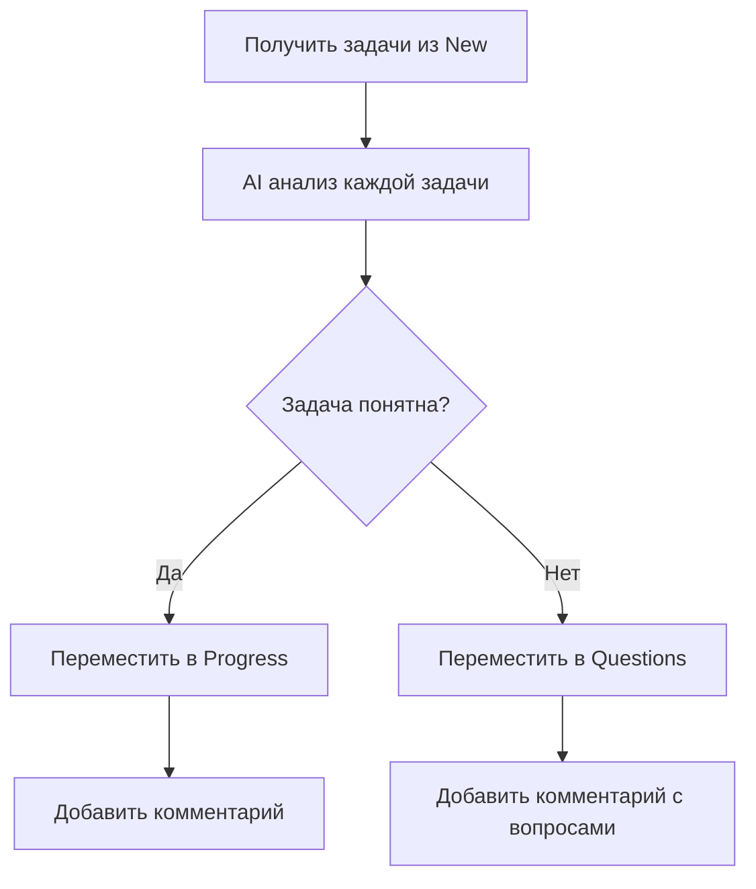
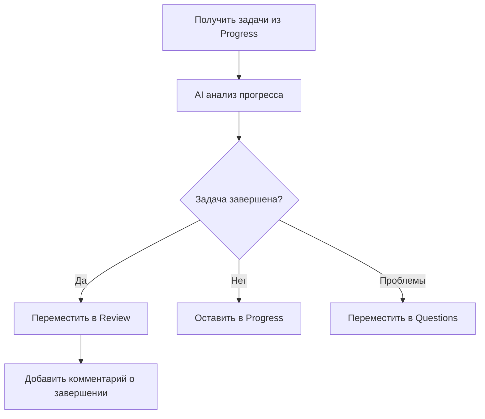

# Run Auto Workflow API

## Описание

Эндпойнт для запуска полного цикла автоматического workflow AI агента.

## Endpoint

```
POST /ai-agent/run-auto-workflow
```

## Описание функциональности

Выполняет полный автоматический цикл обработки задач:

1. **Анализ задач New** - перемещает понятные задачи в In Progress
2. **Проверка задач In Progress** - перемещает завершённые в Review
3. **Агрегация результатов** - объединяет статистику

Этот эндпойнт объединяет функциональность `analyze-new-tasks` и `check-progress-tasks` в единый workflow.

## Параметры запроса

Не требуются (выполняется полный автоматический цикл).

## Пример запроса

```bash
curl -X POST http://localhost:3000/ai-agent/run-auto-workflow \
  -H "Content-Type: application/json"
```

## Ответы

### Успешный ответ (200)

```json
{
  "timestamp": "2025-09-23T15:30:00.000Z",
  "workflowCompleted": true,
  "totalDuration": 3450,
  "phases": {
    "analyzeNewTasks": {
      "completed": true,
      "duration": 1200,
      "tasksAnalyzed": 4,
      "tasksMoved": 3,
      "results": [
        {
          "taskKey": "KAN-20",
          "decision": "move_to_progress",
          "reason": "Clear requirements and well-defined scope",
          "moved": true
        },
        {
          "taskKey": "KAN-21",
          "decision": "move_to_questions",
          "reason": "Missing technical specifications",
          "moved": true
        }
      ]
    },
    "checkProgressTasks": {
      "completed": true,
      "duration": 1800,
      "tasksChecked": 5,
      "tasksMoved": 2,
      "results": [
        {
          "taskKey": "KAN-15",
          "decision": "move_to_review",
          "reason": "Development completed based on comments",
          "moved": true
        },
        {
          "taskKey": "KAN-16",
          "decision": "keep_in_progress",
          "reason": "Still in active development",
          "moved": false
        }
      ]
    }
  },
  "summary": {
    "totalTasksProcessed": 9,
    "totalTasksMoved": 5,
    "newToProgress": 2,
    "newToQuestions": 1,
    "progressToReview": 2,
    "efficiencyScore": 0.85
  },
  "nextRunRecommendation": "2025-09-23T16:30:00.000Z"
}
```

### Структура ответа

| Поле                  | Тип     | Описание                               |
| --------------------- | ------- | -------------------------------------- |
| timestamp             | string  | Временная метка запуска workflow       |
| workflowCompleted     | boolean | Успешность выполнения полного цикла    |
| totalDuration         | number  | Общее время выполнения в миллисекундах |
| phases                | object  | Результаты каждой фазы workflow        |
| summary               | object  | Сводная статистика                     |
| nextRunRecommendation | string  | Рекомендуемое время следующего запуска |

### Структура объекта phases

| Поле               | Тип    | Описание                             |
| ------------------ | ------ | ------------------------------------ |
| analyzeNewTasks    | object | Результаты анализа задач в New       |
| checkProgressTasks | object | Результаты проверки задач в Progress |

### Структура объекта summary

| Поле                | Тип    | Описание                              |
| ------------------- | ------ | ------------------------------------- |
| totalTasksProcessed | number | Общее количество обработанных задач   |
| totalTasksMoved     | number | Общее количество перемещённых задач   |
| newToProgress       | number | Задач перемещено из New в Progress    |
| newToQuestions      | number | Задач перемещено из New в Questions   |
| progressToReview    | number | Задач перемещено из Progress в Review |
| efficiencyScore     | number | Коэффициент эффективности (0-1)       |

## Возможные ошибки

### 500 Internal Server Error

```json
{
  "statusCode": 500,
  "message": "Workflow execution failed",
  "error": "Internal Server Error",
  "details": {
    "failedPhase": "analyzeNewTasks",
    "originalError": "Jira API connection timeout"
  }
}
```

### 503 Service Unavailable

```json
{
  "statusCode": 503,
  "message": "AI service temporarily unavailable",
  "error": "Service Unavailable",
  "retryAfter": 300
}
```

## Логика выполнения workflow

### Фаза 1: Анализ New задач



### Фаза 2: Проверка Progress задач



### Фаза 3: Агрегация и анализ

- Сбор статистики по всем операциям
- Расчёт метрик эффективности
- Генерация рекомендаций
- Планирование следующего запуска

## Метрики эффективности

### Calculation of Efficiency Score

```javascript
const efficiencyScore =
  (successfulMoves / totalTasks) * 0.6 +
  (timelyCompletion / totalMoves) * 0.3 +
  (accuratePredictions / totalPredictions) * 0.1;
```

### Факторы влияния

- **Точность перемещений** (60%) - правильность решений AI
- **Своевременность** (30%) - скорость обработки задач
- **Качество предсказаний** (10%) - точность AI анализа

## Автоматическое планирование

### Умное расписание

AI определяет оптимальное время следующего запуска на основе:

- Активности команды (рабочие часы)
- Частоты создания новых задач
- Загрузки системы
- Исторических данных эффективности

### Адаптивные интервалы

```javascript
// Примеры интервалов
const intervals = {
  highActivity: 30, // минут
  normalActivity: 60, // минут
  lowActivity: 180, // минут
  offHours: 360, // минут
};
```

## Уведомления и отчёты

### Автоматические уведомления

После каждого workflow отправляются:

- Slack/Teams уведомления о результатах
- Email отчёты для менеджеров
- Dashboard обновления
- Webhook события для интеграций

### Еженедельные отчёты

- Статистика эффективности workflow
- Топ-задачи по времени выполнения
- Анализ узких мест в процессе
- Рекомендации по улучшению

## Мониторинг в реальном времени

### Dashboard метрики

- Количество обработанных задач за день
- Средний score эффективности
- Время выполнения workflow
- Успешность AI предсказаний

### Алерты и оповещения

```yaml
alerts:
  - name: Low Efficiency
    condition: efficiencyScore < 0.5
    action: notify_admin

  - name: Workflow Timeout
    condition: duration > 10000
    action: investigation_needed

  - name: High Error Rate
    condition: errorRate > 0.1
    action: disable_auto_mode
```

## Интеграции

### CI/CD Integration

```yaml
# GitHub Actions example
- name: Run AI Workflow
  run: |
    curl -X POST http://api.company.com/ai-agent/run-auto-workflow

- name: Check Workflow Results
  run: |
    # Проверить успешность workflow
    # Продолжить deployment при успехе
```

### Slack Bot Integration

```javascript
// Slack notification example
const workflowResult = await runAutoWorkflow();
await slack.postMessage({
  channel: '#development',
  text: `🤖 AI Workflow completed! 
         Processed: ${workflowResult.summary.totalTasksProcessed} tasks
         Moved: ${workflowResult.summary.totalTasksMoved} tasks
         Efficiency: ${(workflowResult.summary.efficiencyScore * 100).toFixed(1)}%`,
});
```

## Конфигурация

### Переменные окружения

```bash
# Workflow settings
AI_WORKFLOW_ENABLED=true
AI_WORKFLOW_TIMEOUT=300000
AI_WORKFLOW_RETRY_COUNT=3

# Notification settings
AI_WORKFLOW_SLACK_WEBHOOK=https://hooks.slack.com/...
AI_WORKFLOW_EMAIL_NOTIFICATIONS=true

# Performance settings
AI_WORKFLOW_PARALLEL_EXECUTION=true
AI_WORKFLOW_BATCH_SIZE=10
```

### Настройка расписания

```javascript
// Cron patterns for auto-scheduling
const schedules = {
  development: '*/30 * 9-18 * * 1-5', // Каждые 30 мин в рабочие часы
  staging: '0 */2 * * * *', // Каждые 2 часа
  production: '0 */4 * * * *', // Каждые 4 часа
};
```

## Безопасность и надёжность

### Retry механизм

- Автоматический retry при временных сбоях
- Exponential backoff для повторных попыток
- Circuit breaker для защиты от каскадных сбоев

### Rollback возможности

- Логирование всех изменений для отката
- Undo операции для критических ошибок
- Manual override для экстренных случаев

## Анализ и обучение

### Continuous Learning

AI модель обучается на основе:

- Ручных корректировок решений
- Feedback от команды разработки
- Временных метрик выполнения задач
- Успешности предсказаний

### A/B тестирование

- Сравнение разных алгоритмов
- Тестирование новых features
- Оптимизация параметров модели

## Теги Swagger

- **ai-agent** - Эндпойнты AI агента
