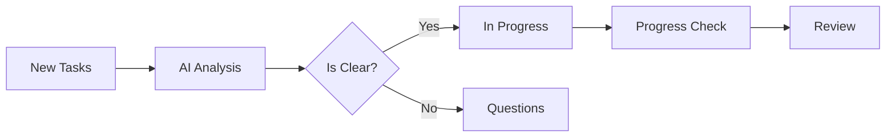
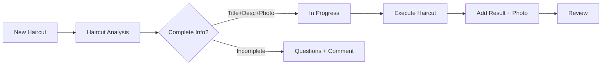

# 🤖 AI Agent - Полное руководство по использованию

## 📋 Содержание

1. [Архитектурный обзор](#архитектурный-обзор)
2. [Основные компоненты](#основные-компоненты)
3. [Workflow процессы](#workflow-процессы)
4. [API Endpoints](#api-endpoints)
5. [Конфигурация и настройка](#конфигурация-и-настройка)
6. [Мониторинг и логирование](#мониторинг-и-логирование)
7. [Расширение функциональности](#расширение-функциональности)

---

## 🏗️ Архитектурный обзор

### Принципы построения

AI Agent построен на базе **модульной архитектуры** с четким разделением ответственности:

```
ai-agent/
├── 🏠 ai-agent.module.ts          # Главный модуль
├── 📁 shared/                     # Общие компоненты
│   ├── ai-base.service.ts         # Базовая AI логика
│   ├── ai-agent-scheduler.service.ts # Планировщик
│   └── shared.module.ts           # Модуль общих сервисов
├── 📁 types/                      # Типы и интерфейсы
│   └── ai-agent.interface.ts
└── 📁 [endpoints]/               # Функциональные модули
    ├── analyze-new-tasks/        # Анализ новых задач
    ├── analyze-haircut-tasks/    # Анализ стрижек
    ├── execute-haircut-tasks/    # Выполнение стрижек
    ├── check-progress-tasks/     # Проверка прогресса
    ├── check-entity-exists/      # Проверка сущностей
    ├── execute-tasks/           # Универсальное выполнение
    ├── run-auto-workflow/       # Автоматический workflow
    └── auto-haircut-monitor/    # Мониторинг стрижек
```

### Ключевые принципы

- **One endpoint = One folder** - каждый функционал в отдельной папке
- **Наследование от AiBaseService** - общая логика в базовом классе
- **Модульность** - независимые модули с четкими интерфейсами
- **Типизация** - строгая типизация всех операций

---

## 🧩 Основные компоненты

### 1. AiBaseService - Базовый AI сервис

**Расположение**: `shared/ai-base.service.ts`

**Основные методы**:

```typescript
// Анализ новых задач
analyzeNewTask(taskKey: string, summary: string, description?: string): TaskAnalysisResult

// Анализ создания сущностей
analyzeEntityCreationTask(taskKey: string, summary: string, description?: string): TaskAnalysisResult

// Анализ задач о стрижках
analyzeHaircutTask(taskKey: string, summary: string, description?: string): TaskAnalysisResult

// Проверка на тематику стрижек
isHaircutRelated(text: string): boolean

// Выполнение решений
executeTaskDecision(analysis: TaskAnalysisResult): Promise<boolean>
```

### 2. AiAgentSchedulerService - Планировщик

**Расположение**: `shared/ai-agent-scheduler.service.ts`

**Cron Jobs**:

```typescript
// АКТИВЕН: Fallback анализ каждый час
@Cron('0 */1 * * *')
handleFallbackAnalysis(): Promise<void>

// ОТКЛЮЧЕНЫ: Заменены на webhook
// handleAutoWorkflow() - каждую минуту
// handleHaircutScheduler() - каждую минуту
```

### 3. Типы данных

**Расположение**: `types/ai-agent.interface.ts`

```typescript
// Результат анализа задачи
interface TaskAnalysisResult {
  taskKey: string;
  isUnderstandable: boolean;
  decision: 'move_to_progress' | 'move_to_questions' | 'stay_in_new';
  reason: string;
  suggestedComment?: string;
}

// Результат проверки прогресса
interface TaskProgressResult {
  taskKey: string;
  isCompleted: boolean;
  decision: 'move_to_review' | 'stay_in_progress';
  reason: string;
  suggestedComment?: string;
}

// Полный отчет workflow
interface WorkflowExecutionResult {
  newTasksProcessed: TaskAnalysisResult[];
  progressTasksProcessed: TaskProgressResult[];
  totalTasksMoved: number;
  errors: string[];
  timestamp: string;
}
```

---

## 🔄 Workflow процессы

### 1. Основной workflow



### 2. Специализированный workflow для стрижек



### 3. Система мониторинга

- **Webhook-driven**: мгновенная реакция на события Jira
- **Cron fallback**: резервная проверка каждый час
- **Detailed logging**: полное логирование всех операций

---

## 🌐 API Endpoints

### Анализ и обработка задач

| Endpoint                         | Method | Описание                          |
| -------------------------------- | ------ | --------------------------------- |
| `/ai-agent/analyze-new-tasks`    | POST   | Анализ всех задач в колонке "New" |
| `/ai-agent/check-progress-tasks` | POST   | Проверка задач в "In Progress"    |
| `/ai-agent/execute-tasks`        | POST   | Универсальное выполнение задач    |
| `/ai-agent/run-auto-workflow`    | POST   | Полный автоматический workflow    |

### Специализированные операции со стрижками

| Endpoint                          | Method | Описание                |
| --------------------------------- | ------ | ----------------------- |
| `/ai-agent/analyze-haircut-tasks` | POST   | Анализ задач о стрижках |
| `/ai-agent/execute-haircut-tasks` | POST   | Выполнение стрижек      |
| `/ai-agent/auto-haircut-monitor`  | GET    | Мониторинг стрижек      |

### Вспомогательные операции

| Endpoint                        | Method | Описание                         |
| ------------------------------- | ------ | -------------------------------- |
| `/ai-agent/check-entity-exists` | POST   | Проверка существования сущностей |

### Примеры использования

#### Анализ новых задач

```bash
curl -X POST https://your-domain/ai-agent/analyze-new-tasks
```

**Ответ**:

```json
{
  "tasksAnalyzed": 5,
  "tasksMoved": 3,
  "results": [
    {
      "taskKey": "KAN-10",
      "decision": "move_to_progress",
      "reason": "Task is clear and actionable",
      "moved": true
    }
  ]
}
```

#### Выполнение стрижек

```bash
curl -X POST https://your-domain/ai-agent/execute-haircut-tasks \
  -H "Content-Type: application/json" \
  -d '{"sourceColumn": "In Progress"}'
```

**Ответ**:

```json
{
  "tasksExecuted": 2,
  "tasksCompleted": 2,
  "executedTasks": []
}
```

---

## ⚙️ Конфигурация и настройка

### Environment переменные

```env
# Jira конфигурация
JIRA_BASE_URL=https://your-domain.atlassian.net
JIRA_EMAIL=your-email@domain.com
JIRA_API_TOKEN=your-api-token
JIRA_PROJECT_KEY=KAN

# AI Agent настройки
AI_AGENT_FALLBACK_ENABLED=true
AI_AGENT_FALLBACK_INTERVAL=3600000  # 1 час в мс
```

### Настройка cron jobs

```typescript
// В ai-agent-scheduler.service.ts
@Cron('0 */1 * * *')  // Каждый час
async handleFallbackAnalysis() {
  // Логика fallback анализа
}

// Для включения отключенных cron jobs:
// Раскомментируйте @Cron декораторы
```

### Настройка ключевых слов

```typescript
// В ai-base.service.ts
private isHaircutRelated(text: string): boolean {
  const keywords = [
    'стрижка', 'haircut', 'причёска', 'парикмахер',
    'hair', 'волосы', 'укладка', 'стиль'
    // Добавьте свои ключевые слова
  ];
  // ...
}
```

---

## 📊 Мониторинг и логирование

### Система логирования

AI Agent использует структурированное логирование с эмодзи-префиксами:

```typescript
// Типы операций
⏰ - Плановые операции (cron jobs)
✂️ - Операции со стрижками
🔍 - Fallback анализ
🤖 - Общие AI операции
🚀 - Выполнение задач
🎯 - Обработка конкретных задач
✅ - Успешные операции
❌ - Ошибки
🎉 - Завершение процессов
```

### Мониторинг через логи

```bash
# Отслеживание активности AI Agent
grep "🤖\|✂️\|🔍" logs/application.log

# Мониторинг ошибок
grep "❌" logs/application.log

# Статистика выполнения
grep "🎉.*complete" logs/application.log
```

### Метрики производительности

- Количество обработанных задач
- Процент успешных перемещений
- Время выполнения операций
- Частота fallback срабатывания

---

## 🔧 Расширение функциональности

### Добавление нового endpoint'а

#### 1. Создание структуры

```bash
mkdir src/ai-agent/my-new-feature
cd src/ai-agent/my-new-feature

# Создание файлов
touch my-new-feature.controller.ts
touch my-new-feature.service.ts
touch my-new-feature.dto.ts
touch my-new-feature.interface.ts
touch my-new-feature.module.ts
touch my-new-feature.spec.ts
```

#### 2. Реализация сервиса

```typescript
// my-new-feature.service.ts
import { Injectable } from '@nestjs/common';
import { AiBaseService } from '../shared/ai-base.service';

@Injectable()
export class MyNewFeatureService extends AiBaseService {
  async execute(): Promise<MyNewFeatureResponse> {
    // Ваша логика
    // Используйте базовые методы:
    // - this.getColumnTasksService
    // - this.moveTaskService
    // - this.addTaskCommentService
    // - this.analyzeNewTask()
  }
}
```

#### 3. Создание контроллера

```typescript
// my-new-feature.controller.ts
import { Controller, Post } from '@nestjs/common';
import { ApiTags, ApiOperation } from '@nestjs/swagger';

@ApiTags('ai-agent')
@Controller('ai-agent')
export class MyNewFeatureController {
  constructor(private readonly myNewFeatureService: MyNewFeatureService) {}

  @Post('my-new-feature')
  @ApiOperation({ summary: 'Описание вашего endpoint' })
  async execute(): Promise<MyNewFeatureResponse> {
    return this.myNewFeatureService.execute();
  }
}
```

#### 4. Регистрация в главном модуле

```typescript
// ai-agent.module.ts
import { MyNewFeatureModule } from './my-new-feature/my-new-feature.module';

@Module({
  imports: [
    // ...existing imports
    MyNewFeatureModule,
  ],
  exports: [
    // ...existing exports
    MyNewFeatureModule,
  ],
})
export class AiAgentModule {}
```

### Добавление новой логики анализа

#### Расширение ключевых слов

```typescript
// В ai-base.service.ts
protected analyzeNewTask(taskKey: string, summary: string, description?: string): TaskAnalysisResult {
  const text = (summary + ' ' + (description || '')).toLowerCase();

  // Добавьте свою логику
  if (text.includes('ваше-ключевое-слово')) {
    return this.analyzeYourCustomTask(taskKey, summary, description);
  }

  // Существующая логика...
}

private analyzeYourCustomTask(taskKey: string, summary: string, description?: string): TaskAnalysisResult {
  // Ваша специализированная логика
  return {
    taskKey,
    isUnderstandable: true,
    decision: 'move_to_progress',
    reason: 'Custom logic applied',
  };
}
```

### Настройка webhook интеграции

```typescript
// Для реакции на события Jira
// В jira-webhook-handler.service.ts добавьте вызов:

if (event.issue_event_type_name === 'issue_created') {
  // Запуск анализа новой задачи
  await this.analyzeNewTasksService.analyzeNewTasks();
}

if (event.issue_event_type_name === 'issue_updated') {
  // Проверка прогресса задачи
  await this.checkProgressTasksService.checkProgressTasks();
}
```

---

## 🚀 Заключение

AI Agent представляет собой мощную и гибкую систему автоматизации Kanban workflow с возможностями:

- **Интеллектуальный анализ** задач на основе ключевых слов
- **Автоматическое перемещение** между колонками
- **Специализированные workflow** (например, для стрижек)
- **Система мониторинга** и fallback механизмы
- **Модульная архитектура** для легкого расширения
- **Полное логирование** всех операций

Система работает в режиме реального времени через webhook'и и обеспечивает надежность через резервные cron jobs.

### Полезные ссылки

- [Общая документация AI Agent](./ai-agent-documentation.md)
- [Детальное описание файлов](./ai-agent-files-detailed.md)
- [Документация Endpoints](./ai-agent-endpoints-detailed.md)
- [Swagger UI](http://localhost:3000/api) - для тестирования API
