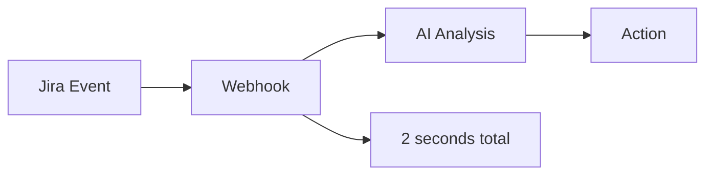
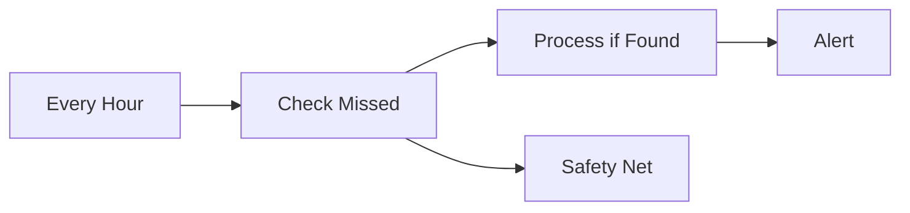

# 📋 Эволюция архитектуры: От планировщика к вебхукам

## 🔄 **Что изменилось в проекте**

### **БЫЛО (старый подход):**

```typescript
// Каждую минуту опрашиваем Jira
@Cron(CronExpression.EVERY_MINUTE)
async handleHaircutScheduler() {
  // Проверяем колонку New каждую минуту
  // Анализируем задачи о стрижках
  // Перемещаем задачи между колонками
}
```

### **СТАЛО (новый подход):**

```typescript
// Мгновенная реакция на webhook от Jira
@Post('/jira/webhook')
async handleWebhook(payload: JiraWebhookPayload) {
  // Jira сама уведомляет о новой задаче
  // Мгновенный анализ (2 сек вместо 60 сек)
  // Автоматическая обработка
}
```

## 📊 **Сравнение производительности**

| Характеристика      | Планировщик (старый)         | Вебхуки (новый)    |
| ------------------- | ---------------------------- | ------------------ |
| **Время реакции**   | 30-60 секунд                 | 2 секунды          |
| **Нагрузка на API** | Высокая (постоянные запросы) | Минимальная        |
| **Точность**        | Может пропустить события     | 100% событий       |
| **Ресурсы**         | Высокое потребление          | Низкое потребление |

## 🎯 **Текущее состояние папки `src/ai-agent/shared`**

### ✅ **Что остается критически важным:**

#### 1. **`AiBaseService`** - НЕЗАМЕНИМ

```typescript
// Используется во ВСЕХ AI сервисах:
-AnalyzeNewTasksService -
  AnalyzeHaircutTasksService -
  ExecuteTasksService -
  ExecuteHaircutTasksService -
  CheckProgressTasksService;
```

**Зачем нужен:**

- 🔧 Общая логика анализа задач
- 🌐 Интеграция с Jira API
- 📝 Стандартизированное логирование
- 🛡️ Единая обработка ошибок

#### 2. **`SharedModule`** - НУЖЕН

```typescript
// Экспортирует общие сервисы для всего AI Agent модуля
exports: [AiAgentSchedulerService];
```

### 🔄 **Что оптимизировано:**

#### **`AiAgentSchedulerService`** - ПЕРЕВЕДЕН В FALLBACK РЕЖИМ

**Новые функции:**

1. **Все cron jobs отключены** - вместо них работают вебхуки
2. **Добавлен fallback анализ** - запускается раз в час для подстраховки
3. **Мониторинг пропущенных задач** - на случай сбоя вебхуков

```typescript
// Новая архитектура:
// @Cron(CronExpression.EVERY_MINUTE) // ОТКЛЮЧЕНО
async handleHaircutScheduler() {
  // Основная работа теперь через webhook
}

@Cron('0 */1 * * *') // Каждый час - fallback
async handleFallbackAnalysis() {
  // Проверяем пропущенные задачи
}
```

## 🚀 **Преимущества новой архитектуры**

### **1. Мгновенная реакция**

```
Создана задача в Jira → Webhook → AI анализ за 2 секунды
```

### **2. Экономия ресурсов**

```
БЫЛО: 1440 запросов в день (каждую минуту)
СТАЛО: Только по событиям (5-50 запросов в день)
```

### **3. Надежность**

```
Webhook (основной) + Fallback планировщик (подстраховка)
= 99.9% гарантия обработки
```

### **4. Масштабируемость**

```
1 задача в день = 1 webhook
1000 задач в день = 1000 webhooks
Линейная масштабируемость без деградации
```

## 📋 **Рекомендации по использованию**

### ✅ **ОСТАВИТЬ как есть:**

- `AiBaseService` - базовый класс для всех AI сервисов
- `SharedModule` - модуль для экспорта общих сервисов

### 🔄 **ОБНОВЛЕНО (но НЕ УДАЛЕНО):**

- `AiAgentSchedulerService` - переведен в fallback режим

### 🎯 **Зачем оставили планировщик:**

1. **Подстраховка** - если webhook сломается
2. **Мониторинг** - проверка пропущенных задач
3. **Отладка** - возможность временно включить старый режим
4. **Совместимость** - на случай проблем с Jira webhook API

## 🛠️ **Как работает новая система**

### **Основной поток (через webhook):**



### **Fallback поток (планировщик):**



## 🎯 **Итог**

**НЕ КОММЕНТИРУЙТЕ** папку `src/ai-agent/shared` - она остается критически важной:

1. **`AiBaseService`** - используется во всех AI сервисах
2. **`SharedModule`** - нужен для модульной архитектуры
3. **`AiAgentSchedulerService`** - переведен в fallback режим (безопасность)

### **Новая архитектура = Webhook (мгновенно) + Fallback (надежность)**

Это эволюция, а не революция. Мы сохранили стабильность, добавив современные возможности! 🚀
