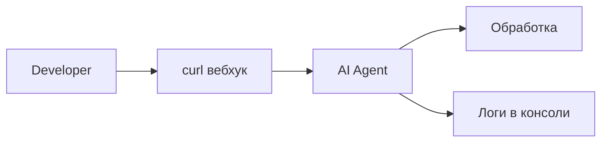
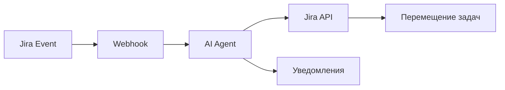

# 🔧 Пошаговая настройка для полной автоматизации

## 📋 **ЧТО У НАС УЖЕ ГОТОВО:**

✅ **AI Agent проект запущен** (`yarn start:dev`)  
✅ **Все API эндпойнты работают**  
✅ **Вебхук обработчик активен**  
✅ **Интеграция с Jira API настроена**

---

## 🚀 **ЧТО НУЖНО СДЕЛАТЬ ДЛЯ ПОЛНОЙ АВТОМАТИЗАЦИИ:**

### **ВАРИАНТ 1: Тестирование (сейчас работает)**

**Что есть:**

- Симуляция вебхуков через curl
- Тестирование AI логики
- Проверка всех компонентов

**Команда для тестирования:**

```bash
curl -X POST http://localhost:3000/jira/webhook \
  -H "Content-Type: application/json" \
  -H "X-Test-Webhook: true" \
  -d '{
    "webhookEvent": "jira:issue_created",
    "issue": {
      "key": "TEST-123",
      "fields": {
        "summary": "Стрижка каре для клиентки",
        "status": {"name": "To Do"}
      }
    }
  }'
```

---

### **ВАРИАНТ 2: Подключение к реальной Jira**

#### **Шаг 1: Настройка переменных окружения**

Создайте файл `.env` со следующими параметрами:

```env
# Jira Configuration (ОБЯЗАТЕЛЬНО)
JIRA_BASE_URL=https://your-company.atlassian.net
JIRA_EMAIL=your-email@company.com
JIRA_API_TOKEN=your-jira-api-token
JIRA_PROJECT_KEY=YOUR_PROJECT

# Webhook Security (РЕКОМЕНДУЕТСЯ)
WEBHOOK_SECRET=your-webhook-secret-here

# Application
PORT=3000
NODE_ENV=development
```

#### **Шаг 2: Получение Jira API токена**

1. Зайдите в **Jira** → **Account Settings** → **Security**
2. Нажмите **Create and manage API tokens**
3. Создайте новый токен и скопируйте его
4. Вставьте в `.env` файл как `JIRA_API_TOKEN`

#### **Шаг 3: Настройка вебхука в Jira**

1. **Jira Administration** → **System** → **Webhooks**
2. **Create a Webhook** со следующими параметрами:

```
Name: AI Agent Webhook
Status: ✅ Enabled
URL: http://your-server.com:3000/jira/webhook

Events to listen for:
☑️ Issue → Created
☑️ Issue → Updated
☑️ Comment → Created

JQL Filter (опционально):
project = YOUR_PROJECT_KEY

Secret: your-webhook-secret-here
```

#### **Шаг 4: Тестирование подключения**

```bash
# Проверяем подключение к Jira
curl http://localhost:3000/jira/health

# Должен вернуть:
# {"status": "healthy", "timestamp": "..."}
```

---

## 🎯 **СЦЕНАРИИ ИСПОЛЬЗОВАНИЯ**

### **Сценарий A: Локальная разработка (работает сейчас)**



**Используется:**

- Симуляция событий Jira
- Тестирование AI логики
- Отладка алгоритмов

### **Сценарий B: Продакшн с Jira (требует настройки)**



**Требует:**

- Настройку API токенов
- Конфигурацию вебхуков
- Публичный URL для сервера

---

## 🔍 **ДЕТАЛЬНАЯ ПРОВЕРКА ГОТОВНОСТИ**

### **1. Проверим текущую конфигурацию**

```bash
# Проверяем переменные окружения
echo "JIRA_BASE_URL: $JIRA_BASE_URL"
echo "JIRA_EMAIL: $JIRA_EMAIL"
echo "JIRA_PROJECT_KEY: $JIRA_PROJECT_KEY"
```

### **2. Тестируем подключение к Jira**

```bash
curl http://localhost:3000/jira/health
```

### **3. Проверяем AI сервисы**

```bash
# Анализ стрижек
curl -X POST http://localhost:3000/ai-agent/analyze-haircut-tasks \
  -H "Content-Type: application/json" \
  -d '{"sourceColumn": "New"}'

# Анализ новых задач
curl -X POST http://localhost:3000/ai-agent/analyze-new-tasks \
  -H "Content-Type: application/json" \
  -d '{"sourceColumn": "New"}'
```

---

## ⚡ **БЫСТРЫЙ СТАРТ ДЛЯ ТЕСТИРОВАНИЯ**

**Что работает прямо сейчас без дополнительной настройки:**

```bash
# 1. Запустите проект (если не запущен)
yarn start:dev

# 2. Симулируйте создание задачи о стрижке
curl -X POST http://localhost:3000/jira/webhook \
  -H "Content-Type: application/json" \
  -H "X-Test-Webhook: true" \
  -d '{
    "webhookEvent": "jira:issue_created",
    "timestamp": 1695461200000,
    "issue": {
      "key": "SALON-999",
      "fields": {
        "summary": "Стрижка + окрашивание для новой клиентки",
        "status": {"name": "To Do"}
      }
    }
  }'

# 3. Проверьте результат в логах консоли
```

**Ожидаемый результат:**

```json
{
  "success": true,
  "message": "Webhook processed successfully",
  "triggeredActions": ["haircut-analysis", "notification-sent"],
  "timestamp": "2025-09-23T18:21:10.856Z",
  "issueKey": "SALON-999",
  "processingTimeMs": 2003
}
```

---

## 🎯 **ИТОГО: ЧТО НУЖНО**

### **Для тестирования (готово сейчас):**

1. ✅ **Запущенный проект** (`yarn start:dev`)
2. ✅ **Симуляция через curl**
3. ✅ **Логи в консоли**

### **Для продакшена (требует настройки):**

1. ⚙️ **Настройка .env с Jira токенами**
2. ⚙️ **Создание вебхука в Jira Admin**
3. ⚙️ **Публичный URL для сервера**

### **Для создания задач в реальной Jira:**

1. ⚙️ **Подключение к Jira API**
2. ⚙️ **Настройка проекта в Jira**
3. ⚙️ **Конфигурация колонок (New, In Progress, Done, etc.)**

---

**ВЫВОД:** Система полностью готова для тестирования! Для продакшена нужна только настройка подключения к вашей Jira.
