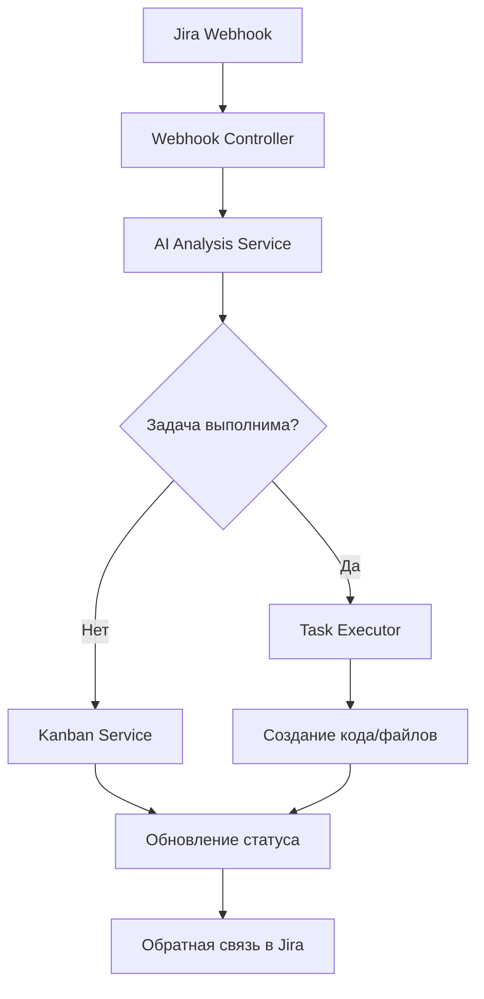

# 📁 Структура папки `src` - Обзор

## 🎯 Общее описание

Папка `src` содержит весь исходный код приложения **Kanban AI Agent** - системы автоматизации Kanban досок с помощью искусственного интеллекта.

## 📦 Архитектура проекта

Проект построен на **NestJS** и следует модульной архитектуре:

```
src/
├── 🏠 app.*                    # Корневые файлы приложения
├── 🚀 main.ts                  # Точка входа приложения
├── 🤖 ai-analysis/            # Модуль AI анализа задач
├── ⚙️ config/                 # Конфигурация приложения
├── 📋 dto/                    # Data Transfer Objects
├── 🏢 kanban/                 # Модуль работы с Kanban досками
├── 🤖 task-executor/          # Модуль выполнения задач AI агентом
├── 🔧 types/                  # Типы и интерфейсы TypeScript
└── 🌐 webhook/                # Модуль обработки webhook'ов
```

## 🔥 Ключевые возможности

### 🤖 AI-Powered Features

- **Автоматический анализ задач** - AI определяет тип и сложность
- **Умное перемещение задач** - автоматическое управление статусами
- **Выполнение задач** - AI генерирует код и создает файлы

### 🔗 Интеграции

- **Jira** - полная интеграция с Atlassian Jira
- **Claude AI** - использование Claude API для анализа
- **TypeORM** - работа с базами данных (готово к подключению)

### 🛠 Технический стек

- **NestJS** - основной фреймворк
- **TypeScript** - строгая типизация
- **RxJS** - реактивное программирование
- **class-validator** - валидация данных

## 📚 Документация модулей

Подробное описание каждого модуля:

1. **[AI Analysis](01-ai-analysis.md)** - Модуль анализа задач с помощью AI
2. **[Config](02-config.md)** - Система конфигурации приложения
3. **[DTO](03-dto.md)** - Объекты передачи данных
4. **[Kanban](04-kanban.md)** - Работа с Kanban досками и Jira
5. **[Task Executor](05-task-executor.md)** - AI агент для выполнения задач
6. **[Types](06-types.md)** - Типы и интерфейсы
7. **[Webhook](07-webhook.md)** - Обработка входящих webhook'ов

## 🎯 Workflow системы



## 📊 Статистика проекта

- **Модули:** 6 основных модулей
- **Файлы:** ~25 TypeScript файлов
- **Сервисы:** 8 основных сервисов
- **Контроллеры:** 3 REST контроллера

## 🚀 Следующие шаги

Система готова к:

- ✅ Автоматической обработке Jira задач
- ✅ AI анализу и выполнению задач
- ✅ Генерации кода для простых сущностей
- 🔄 Расширению функционала AI агента
- 🔄 Добавлению новых типов задач
