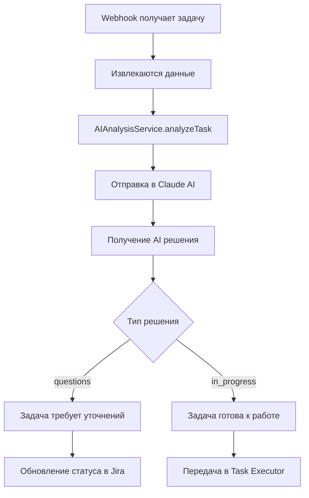

# 🤖 AI Analysis Module

## 📍 Расположение: `src/ai-analysis/`

## 🎯 Назначение

Модуль **AI Analysis** отвечает за анализ задач с помощью искусственного интеллекта. Он принимает описания задач и определяет, как с ними поступить: отправить на уточнение или перевести в работу.

## 📁 Структура

```
src/ai-analysis/
├── ai-analysis.module.ts    # NestJS модуль
├── ai-analysis.service.ts   # Основной сервис AI анализа
└── index.ts                 # Экспорты модуля
```

## 🔧 Компоненты

### 🟦 `AIAnalysisModule`

**Файл:** `ai-analysis.module.ts`

NestJS модуль, который:

- Регистрирует `AIAnalysisService`
- Экспортирует сервис для использования в других модулях
- Настраивает зависимости для работы с Claude AI

```typescript
@Module({
  providers: [AIAnalysisService],
  exports: [AIAnalysisService],
})
export class AIAnalysisModule {}
```

### 🟢 `AIAnalysisService`

**Файл:** `ai-analysis.service.ts`

Основной сервис для работы с AI. Возможности:

#### 📊 Анализ задач

- **Метод:** `analyzeTask(taskData: TaskAnalysisDto)`
- **Результат:** AI решение о том, что делать с задачей
- **Варианты решений:**
  - `questions` - нужны уточнения
  - `in_progress` - можно переводить в работу

#### 🧠 AI Логика

```typescript
// Пример анализа
const result = await aiAnalysisService.analyzeTask({
  title: "Создать API для пользователей",
  description: "Нужно создать REST API...",
  context: "Status: To Do",
  priority: "High"
});

// Результат:
{
  decision: 'in_progress',
  reasoning: 'Задача хорошо описана и готова к выполнению',
  questions: [],
  suggestedActions: ['Создать контроллер', 'Написать тесты']
}
```

#### 🔗 Интеграция с Claude AI

- Использует Claude API для анализа
- Отправляет structured prompts
- Получает JSON ответы с решениями

## 🔄 Workflow



## 🎯 Типы анализируемых задач

### ✅ Хорошо анализируемые

- Создание API эндпоинтов
- Создание сущностей и моделей
- Простые CRUD операции
- Рефакторинг кода

### ❓ Требующие уточнений

- Задачи без технических деталей
- Слишком общие формулировки
- Задачи с неопределенными требованиями

## 📈 Примеры использования

### Создание сущности

```typescript
// Входные данные
{
  title: "Создать сущность User",
  description: "Нужна модель пользователя с полями: name, email",
  context: "Status: To Do",
  priority: "Medium"
}

// AI решение
{
  decision: 'in_progress',
  reasoning: 'Четко описана сущность, можно создавать',
  suggestedActions: [
    'Создать Entity класс',
    'Добавить валидацию',
    'Создать DTO'
  ]
}
```

### Неясная задача

```typescript
// Входные данные
{
  title: "Улучшить систему",
  description: "Надо что-то сделать",
  context: "Status: To Do"
}

// AI решение
{
  decision: 'questions',
  reasoning: 'Задача слишком общая, нужны детали',
  questions: [
    'Какую именно часть системы улучшить?',
    'Какие конкретные проблемы решить?',
    'Есть ли технические требования?'
  ]
}
```

## 🔗 Связи с другими модулями

- **Webhook Service** - получает задачи для анализа
- **Task Executor** - получает задачи, готовые к выполнению
- **Kanban Service** - обновляет статусы на основе AI решений

## ⚙️ Конфигурация

Модуль использует настройки из `config/claude.config.ts`:

- API ключ Claude
- Модель AI (claude-3-sonnet)
- Системные промпты
- Лимиты запросов

## 🚀 Расширение функционала

Планируется добавить:

- 🔄 Анализ сложности задач
- 🔄 Оценка времени выполнения
- 🔄 Автоматическое создание подзадач
- 🔄 Интеграция с другими AI моделями
