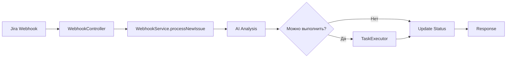
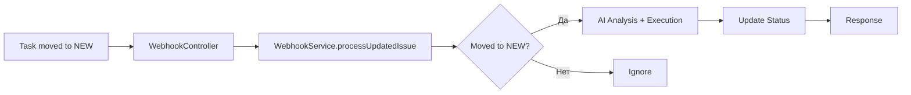

# 🔗 Webhook Module

## 📍 Расположение: `src/webhook/`

## 🎯 Назначение

Модуль **Webhook** — это входная точка системы, которая принимает уведомления от Jira и запускает автоматизированную обработку задач. Он является связующим звеном между внешними системами и внутренней логикой AI агента.

## 📁 Структура

```
src/webhook/
├── index.ts              # Центральный экспорт модуля
├── webhook.module.ts     # NestJS модуль
├── webhook.controller.ts # REST контроллер для приема webhook'ов
└── webhook.service.ts    # Основная логика обработки webhook'ов
```

## 🔧 Основные компоненты

### 🟦 `WebhookModule`

**Файл:** `webhook.module.ts`

- Импортирует `AIAnalysisModule`, `KanbanModule`, `TaskExecutorModule`
- Регистрирует `WebhookController` и `WebhookService`
- Экспортирует `WebhookService` для использования в других модулях

### 🟢 `WebhookController`

**Файл:** `webhook.controller.ts`

#### Endpoint: `POST /webhook/jira`

Принимает webhook'и от Jira и обрабатывает два типа событий:

- **`jira:issue_created`** — создание новой задачи
- **`jira:issue_updated`** — обновление существующей задачи

#### Пример настройки webhook в Jira:

```
URL: https://your-domain.com/webhook/jira
Events: Issue Created, Issue Updated
```

#### Пример запроса:

```bash
curl -X POST https://your-app.com/webhook/jira \
  -H "Content-Type: application/json" \
  -d '{
    "webhookEvent": "jira:issue_created",
    "issue": {
      "key": "KAN-123",
      "fields": {
        "summary": "Создать сущность User",
        "description": "Необходимо создать сущность для управления пользователями",
        "status": {"name": "NEW"},
        "priority": {"name": "High"}
      }
    }
  }'
```

#### Ответы контроллера:

```typescript
// Успешная обработка
{
  "status": "success",
  "message": "Webhook processed successfully",
  "issueKey": "KAN-123",
  "decision": "in_progress"
}

// Игнорируемое событие
{
  "status": "ignored",
  "message": "Event type not processed",
  "event": "jira:issue_deleted"
}

// Ошибка
{
  "status": "error",
  "message": "Failed to process webhook",
  "error": "Invalid payload format"
}
```

### 🟢 `WebhookService`

**Файл:** `webhook.service.ts`

Основной сервис с ключевыми методами:

#### 🔄 `processNewIssue(payload)`

Обрабатывает создание новой задачи:

1. **Извлечение данных** из Jira payload
2. **AI анализ** задачи через `AIAnalysisService`
3. **Проверка автоматического выполнения** через `TaskExecutorService`
4. **Выполнение задачи** (если возможно)
5. **Обновление статуса** в Jira через `KanbanService`

#### 🔄 `processUpdatedIssue(payload)`

Обрабатывает обновление задачи:

1. **Проверка перемещения** в колонку NEW
2. **Запуск AI обработки** (если нужно)
3. **Автоматическое выполнение** (если возможно)
4. **Обновление статуса** в Jira

#### 🔍 `wasMovedToNewColumn(changelog, currentStatus)`

Определяет, была ли задача перемещена в колонку "NEW":

```typescript
// Поддерживаемые статусы NEW
const newStatuses = ['NEW', 'New', 'To Do', 'NEW TASK', 'new'];
```

#### 🔄 `updateTaskStatus(taskKey, aiDecision, reasoning)`

Обновляет статус задачи в Jira на основе решения AI:

```typescript
// Маппинг решений AI к статусам
const statusMapping = {
  questions: TaskStatus.QUESTIONS, // Нужны уточнения
  in_progress: TaskStatus.IN_PROGRESS, // Можно выполнять
};
```

#### 📋 `extractTaskData(payload)`

Извлекает данные задачи из Jira payload:

```typescript
return {
  title: issue.fields.summary,
  description: issue.fields.description || '',
  context: `Status: ${issue.fields.status?.name}`,
  priority: issue.fields.priority?.name,
  labels: issue.fields.labels || [],
};
```

## 🔄 Рабочий процесс

### Сценарий 1: Создание новой задачи



### Сценарий 2: Перемещение в NEW



## 🔗 Интеграции

### Используемые модули:

- **AIAnalysisService** — анализ задач AI
- **KanbanService** — обновление статусов в Jira
- **TaskExecutorService** — автоматическое выполнение задач

### Пример полного цикла:

```typescript
// 1. Получение webhook от Jira
const payload = { webhookEvent: 'jira:issue_created', issue: {...} };

// 2. AI анализ
const aiResult = await aiAnalysisService.analyzeTask(taskData);

// 3. Проверка возможности выполнения
const executionPlan = taskExecutorService.analyzeTaskForExecution(...);

// 4. Выполнение (если возможно)
if (executionPlan) {
  const results = await taskExecutorService.executeTask(executionPlan);
}

// 5. Обновление статуса в Jira
await kanbanService.updateTaskStatus({
  taskKey: 'KAN-123',
  newStatus: TaskStatus.IN_PROGRESS,
  comment: 'AI analysis completed. Task can be executed automatically.'
});
```

## 🛡️ Безопасность

### Валидация webhook'ов (временно отключена):

```typescript
private validateWebhookSecret(headers: Record<string, string>) {
  const webhookSecret = this.configService.get<string>('app.webhook.secret');
  const receivedSecret = headers['x-webhook-secret'] || headers['authorization'];

  if (receivedSecret !== webhookSecret) {
    throw new HttpException('Invalid webhook secret', HttpStatus.UNAUTHORIZED);
  }
}
```

### Валидация payload:

```typescript
validatePayload(payload: any): boolean {
  return !!(payload?.issue?.key && payload?.issue?.fields?.summary);
}
```

## 🔧 Конфигурация

### Переменные окружения:

```env
# Webhook secret для безопасности
WEBHOOK_SECRET=your-secret-key

# Jira конфигурация
JIRA_BASE_URL=https://your-company.atlassian.net
JIRA_EMAIL=your-email@company.com
JIRA_API_TOKEN=your-api-token
```

## 📊 Логирование

Сервис подробно логирует все этапы обработки:

```
🎯 Processing new issue: KAN-123
📋 Task data extracted: Создать сущность User
🤖 AI analysis complete. Decision: in_progress
✨ Task is executable. Starting execution...
🎉 Task executed successfully!
✅ Issue processing complete for KAN-123
```

---

**Webhook Module — это сердце автоматизации, превращающее внешние события в умные действия!** 🚀🤖
